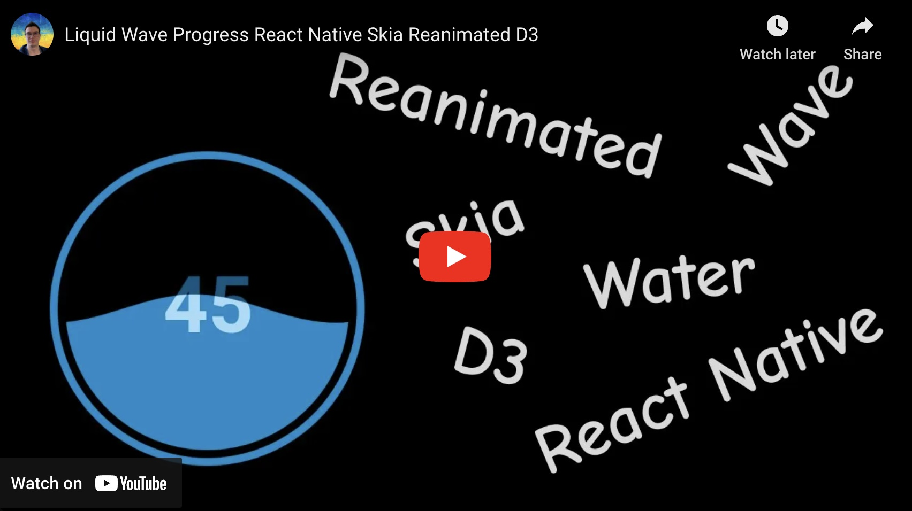
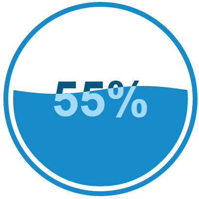
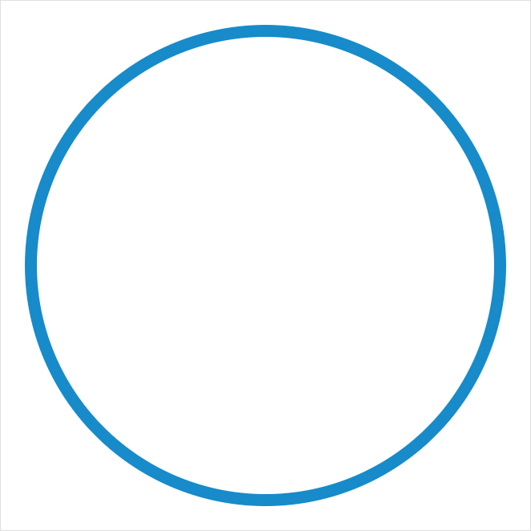
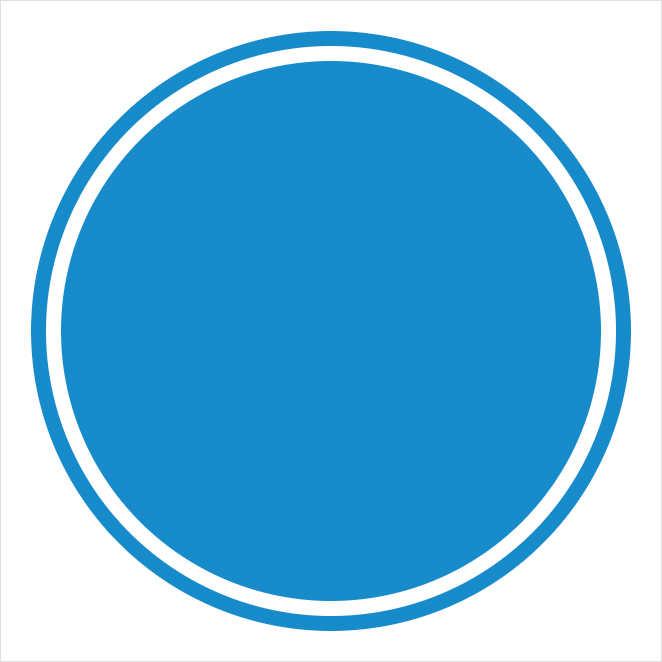
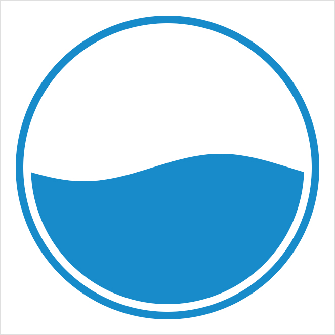
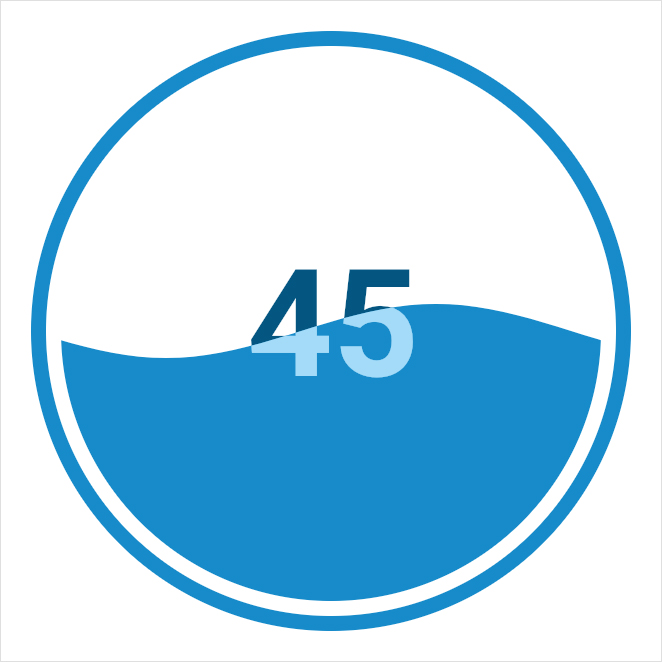
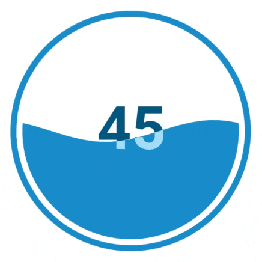
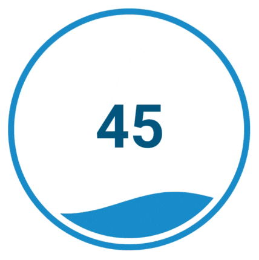
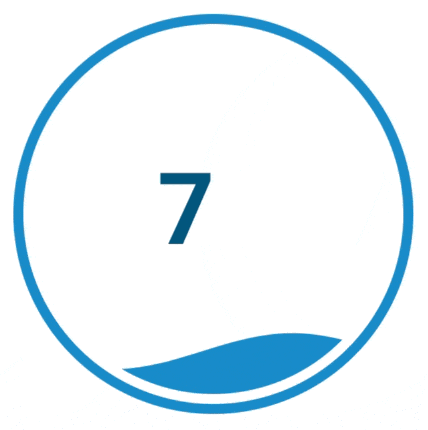

# React Native Liquid Gauge Tutorial

<div>
  <a align="center" href="https://github.com/dimaportenko?tab=followers">
    
  </a>
  <br/>
  <a align="center" href="https://twitter.com/dimaportenko">
    
  </a>
  <br/>
  <a align="center" href="https://www.youtube.com/channel/UCReKeeIMZywvQoaZPZKzQbQ">
    
  </a>
  <br/>
  <a align="center" href="https://www.youtube.com/channel/UCReKeeIMZywvQoaZPZKzQbQ">
    
  </a>
   <br/>
  <a align="center" href="https://www.twitch.tv/lost_semicolon">
    
  </a>
</div>
<br/>

<a href="https://youtu.be/CGcLDoZWciA" target="_blank">
    
</a>
<br/>
<br/>

## Get Started 

<!-- Intro for tutorial for liquid gauge progress indicator for react native, with react-native-skia and react-native-reanimated -->
Some time ago I saw this cool [Liquid Fill Gauge Gist](https://gist.github.com/brattonc/5e5ce9beee483220e2f6) with cool animated web svg component. Immediatly I thought it would be cool to have it in react native. It took me some effort to make it works. So I decided to make a tutorial for it. I will use [react-native-skia](https://shopify.github.io/react-native-skia/) and [react-native-reanimated](https://docs.swmansion.com/react-native-reanimated/).


<!-- TODO: better demo gif where we can see progress animation --> <!-- insert image from docs/demo.gif -->



First of all, let's install [react-native-skia](https://shopify.github.io/react-native-skia/) (please follow official docs for it). Now let's create new component and draw circle.

```typescript 
import { Canvas, Circle } from "@shopify/react-native-skia";

type Props = {
  size: number;
};

export const LiquidGaugeProgress = ({ size }: Props) => {
  const radius = size * 0.5;
  const circleThickness = radius * 0.05;

  return (
    <Canvas style={{ width: size, height: size }}>
      <Circle
        cx={radius}
        cy={radius}
        r={radius - circleThickness * 0.5}
        color="#178BCA"
        style="stroke"
        strokeWidth={circleThickness}
      />
    </Canvas>
  );
}; 
```

<div style="">
    
</div>


Render everything inside the Canvas with width and height of size. Draw Circle which fits canvas size. We will use `stroke` style to draw only border of the circle. We will use `strokeWidth` to set thickness of the border. 

Now let's add inner circle which will represent water wave later with clip path.

```typescript
  ...

  const circleFillGap = 0.05 * radius;
  const fillCircleMargin = circleThickness + circleFillGap;
  const fillCircleRadius = radius - fillCircleMargin;

  return (
    <Canvas style={{ width: size, height: size }}>
      <Circle
          ...
      />

      <Circle
        cx={radius}
        cy={radius}
        r={fillCircleRadius}
        color="#178BCA"
      />
    </Canvas>
  );
```

<div style="">
    
</div>

<!-- TODO: add image for each step -->

We draw another circle which fill space inside. And we want to clip this circle with SVG path. We will use `d3` library to generate this path, so let's install it. 

```bash
npx expo install d3 @types/d3
```

Now we will have quate big code snippet of clipped inner circle with wave form path. I put comment almost on each line of code to explain what is doing. If you don't get something please ask in comments.

```typescript
import { Canvas, Circle, Group, Path, Skia } from "@shopify/react-native-skia";
import { area, scaleLinear } from "d3";

type Props = {
  size: number;
  value: number;
};

export const LiquidGaugeProgress = ({ size, value }: Props) => {
  const radius = size * 0.5; // outer circle
  const circleThickness = radius * 0.05; // 0.05 just coefficient can be anything you like

  const circleFillGap = 0.05 * radius; // 0.05 just coefficient can be anything you like
  const fillCircleMargin = circleThickness + circleFillGap;
  const fillCircleRadius = radius - fillCircleMargin; // inner circle radius

  const minValue = 0; // min possible value
  const maxValue = 100; // max possible value
  const fillPercent = Math.max(minValue, Math.min(maxValue, value)) / maxValue; // percent of how much progress filled 

  const waveCount = 1; // how many full waves will be seen in the circle
  const waveClipCount = waveCount + 1; // extra wave for translate x animation
  const waveLength = (fillCircleRadius * 2) / waveCount; // wave length base on wave count 
  const waveClipWidth = waveLength * waveClipCount; // extra width for translate x animation
  const waveHeight = fillCircleRadius * 0.1; // wave height relative to the circle radius, if we change component size it will look same

  // Data for building the clip wave area.
  // [number, number] represent point
  // we have 40 points per wave
  // we generate as many points as 40 * waveClipCount
  const data: Array<[number, number]> = [];
  for (let i = 0; i <= 40 * waveClipCount; i++) {
    data.push([i / (40 * waveClipCount), i / 40]);
  }

  const waveScaleX = scaleLinear().range([0, waveClipWidth]).domain([0, 1]); // interpolate value between 0 and 1 to value between 0 and waveClipWidth 
  const waveScaleY = scaleLinear().range([0, waveHeight]).domain([0, 1]); // interpolate value between 0 and 1 to value between 0 and waveHeight

  // area take our data points 
  // output area with points (x, y0) and (x, y1)
  const clipArea = area()
    .x(function (d) {
      return waveScaleX(d[0]); // interpolate value between 0 and 1 to value between 0 and waveClipWidth 
    })
    .y0(function (d) {
      // interpolate value between 0 and 1 to value between 0 and waveHeight
      return waveScaleY(
        Math.sin(d[1] * 2 * Math.PI),
      );
    })
    .y1(function (_d) {
      // same y1 value for each point 
      return fillCircleRadius * 2 + waveHeight;
    });

  const clipSvgPath = clipArea(data); // convert data points as wave area and output as svg path string 
  const clipPath = Skia.Path.MakeFromSVGString(clipSvgPath); // convert svg path string to skia format path
  const transformMatrix = Skia.Matrix(); // create Skia tranform matrix 
  transformMatrix.translate(
    0, // translate x to 0, basically do nothing
    fillCircleMargin + (1 - fillPercent) * fillCircleRadius * 2 - waveHeight, // translate y to position where lower point of the wave in the innerCircleHeight * fillPercent
  );
  clipPath.transform(transformMatrix); // apply transform matrix to our clip path

  return (
    <Canvas style={{ width: size, height: size }}>
      <Circle
        cx={radius}
        cy={radius}
        r={radius - circleThickness * 0.5}
        color="#178BCA"
        style="stroke"
        strokeWidth={circleThickness}
      />

      {/* clip everything inside this group with clip path */}
      <Group clip={clipPath}> 
        <Circle cx={radius} cy={radius} r={fillCircleRadius} color="#178BCA" />
      </Group>
    </Canvas>
  );
};

```

<div style="">
    
</div>
<!-- TODO: add image for each step -->

Now when we have clip area let's add some text. Skia text component require font. So let's download [roboto bold](https://fonts.google.com/specimen/Roboto) font. And put it into assets/fonts directory.

```typescript
import { useFont, Text } from "@shopify/react-native-skia";

// ...

const fontSize = radius / 2; // font size is half of the radius
const font = useFont(require('../assets/fonts/Roboto-Regular.ttf'), fontSize); // create font with font file and size

const text = `${value}`; // convert value to string
const textWidth = font?.getTextWidth(text) ?? 0; // get text width
const textTranslateX = radius - textWidth * 0.5; // calculate text X position to center it horizontally
const textTransform = [{ translateY: size * 0.5 - fontSize * 0.7 }]; // calculate vertical center position. Half canvas size - half font size. But since characters isn't centered inside font rect we do 0.7 instead of 0.5.

// ... 

return (
    <Canvas style={{ width: size, height: size }}>
      <Circle
        {/* ... */}
      />

      {/* Text which will be drawn above the wave (water) */}
      <Text
        x={textTranslateX}
        y={fontSize}
        text={text}
        font={font}
        color="#045681"
        transform={textTransform}
      />

      {/* clip everything inside this group with clip path */}
      <Group clip={clipPath}>
        <Circle cx={radius} cy={radius} r={fillCircleRadius} color="#178BCA" />

        {/* Text which will be drawn under the wave (water) */}
        <Text
          x={textTranslateX}
          y={fontSize}
          text={text}
          font={font}
          color="#A4DBf8"
          transform={textTransform}
        />
      </Group>
    </Canvas>
  );
```
<div style="">
    
</div>

So we added font and calculated text posiotion (explained in the code comments). Then we added two Text components with same params but different colors. One reder above the water wave, and another - under the water wave. What give us nice effect that text is in the water. 

Now we want to animated our wave. So let's install [react-native-reanimated](https://docs.swmansion.com/react-native-reanimated/docs/fundamentals/getting-started/#installation). Simply follow official documentation [reanimated installation](https://docs.swmansion.com/react-native-reanimated/docs/fundamentals/getting-started/#installation) or for [expo installation](https://docs.expo.dev/versions/latest/sdk/reanimated/#installation). 

Now we create `translateXAnimated` which change from 0 to 1 over 9 seconds and repeat in infinity loop. Then we wrap our `clipPath` value in `useDerivedValue` where we apply our `translateXAnimated` to x position of clip path. Each line has extra comment. Don't hesitate to ask the question if you need additional explanation. 
```typescript
import {
  Easing,
  useDerivedValue,
  useSharedValue,
  withRepeat,
  withTiming,
} from "react-native-reanimated";

// ...

  const translateXAnimated = useSharedValue(0); // animated value translate wave horizontally
  useEffect(() => {
    translateXAnimated.value = withRepeat(
      // repeat animation
      withTiming(1, {
        // animate from 0 to 1
        duration: 9000, // animation duration
        easing: Easing.linear, // easing function
      }),
      -1, // repeat forever
    );
  }, []);

  const clipPath = useDerivedValue(() => {
    // animated value for clip wave path
    const clipP = Skia.Path.MakeFromSVGString(clipSvgPath); // convert svg path string to skia format path
    const transformMatrix = Skia.Matrix(); // create Skia tranform matrix
    transformMatrix.translate(
      fillCircleMargin - waveLength * translateXAnimated.value, // translate left from start of the first wave to the length of first wave
      fillCircleMargin + (1 - fillPercent) * fillCircleRadius * 2 - waveHeight, // translate y to position where lower point of the wave in the innerCircleHeight * fillPercent
    );
    clipP.transform(transformMatrix); // apply transform matrix to our clip path
    return clipP;
  }, [translateXAnimated]);
```

<div style="">
    
</div>

We can do same to animate Y translation. 

```typescript
  const translateYPercent = useSharedValue(0); // animated value translate wave vertically

  useEffect(() => {
    translateYPercent.value = withTiming(fillPercent, { // timing animation from 0 to `fillPercent`
      duration: 1000, // animation duration
    });
    // eslint-disable-next-line react-hooks/exhaustive-deps
  }, [fillPercent]);


  // update transformMatrix like this
  transformMatrix.translate(
    fillCircleMargin - waveLength * translateXAnimated.value, // translate left from start of the first wave to the length of first wave
    fillCircleMargin + (1 - translateYPercent.value) * fillCircleRadius * 2 - waveHeight, // translate y to position where lower point of the wave in the innerCircleHeight * fillPercent
    // since Y axis 0 is in the top, we do animation from 1 to (1 - fillPercent)
  );
```

<div style="">
    
</div>

And last thing is to animate text value.
```typescript
  const textValue = useSharedValue(0); // animated value for text

  useEffect(() => {
    textValue.value = withTiming(value, { // animate from 0 to `value`
      duration: 1000, // duration of animation
    });
    // eslint-disable-next-line react-hooks/exhaustive-deps
  }, [value]);

  const text = useDerivedValue(() => { // derived value for the Text component
    return `${textValue.value.toFixed(0)}`; // convert to string 
  }, [textValue]);
```

<div style="">
    
</div>

Hooray! We did it. This is basically all in terms of tutorial scope. If you like to have ready to use configurable component take a look [react-native-gauge-pprogress](https://github.com/dimaportenko/react-native-liquid-gauge) a wrap it as a simple lib. 

